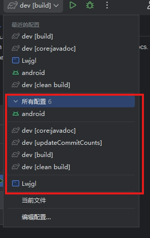

# Get Started

A [libGDX](https://libgdx.com/) project generated with [gdx-liftoff](https://github.com/libgdx/gdx-liftoff).

This project was generated with a template including simple application launchers and an `ApplicationAdapter` extension that draws libGDX logo.

## Platforms

- `core`: Main module with the application logic shared by all platforms.
- `lwjgl3`: Primary desktop platform using LWJGL3; was called 'desktop' in older docs.
- `android`: Android mobile platform. Needs Android SDK.

## Idea

- 从上至下依次为
  - `android` 安卓平台运行调试
  - `javadoc` 代码说明文档生成(包含在项目构建中)
  - `commits-tick` 刷新实际提交人员代码提交次数
  - `gradle build` 项目构建
  - `gradle clean build` 项目清理构建
  - `Lwjgl` 桌面平台运行调试

## Gradle
